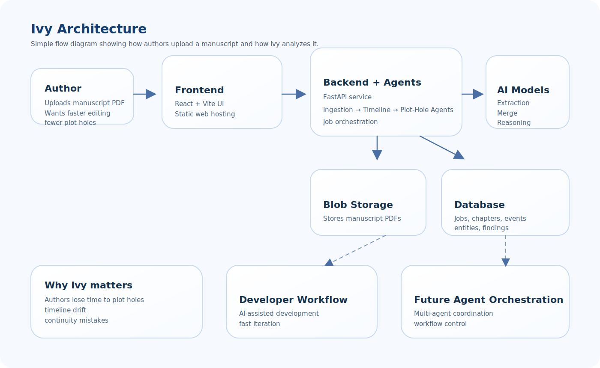

# Ivy - AI Dev Days Hackathon Submission

Ivy is an Azure-backed story-analysis assistant for authors. It ingests a manuscript PDF, extracts chapter summaries and characters, builds a global timeline, and flags plot holes or inconsistencies before they slow a book down._

DEMO: https://youtu.be/ekUmYZkNP70

---

## Team Members

- **Kee5625** (Backend & Cloud Architecture)
  - GitHub: [kee5625](https://github.com/kee5625)
  - Microsoft Innovative Studio: [Karthik Rachamolla]
- **Sharvan R** (Frontend Development)
  - GitHub: [@sharvanr](https://github.com/sharvanr)

---

## More secription

- **Microsoft Azure AI Foundry:** The core intelligence of Ivy is powered by AI Foundry. We utilize `gpt-4o-mini` and `gpt-4.1` deployments to drive our multi-agent orchestration pipeline (Ingestion, Timeline Merging, and Plot Hole Detection).
- **Azure Deployment:** Ivy is a almost production-ready cloud application deployed natively on Azure services, utilizing **Azure Container Apps**, **Azure Static Web Apps**, **Azure Cosmos DB**, and **Azure Blob Storage**.
- **Agentic Design & Innovation:** We implemented a sophisticated multi-agent pipeline that transforms raw unstructured text (PDF) into a globally ordered narrative state, allowing downstream agents to reason over complex story continuity.

---

## Project Description

Writing a book often takes far longer than it should because authors have to constantly re-check their own continuity (for longer than 5 years sometimes). Character details drift, timelines stop lining up, setups are forgotten, and plot holes appear across chapters that were written weeks or months apart.

Ivy is built to reduce that friction. It acts like a narrative QA layer for long-form fiction so authors can catch inconsistencies earlier, spend less time manually cross-referencing chapters, and move from draft to finished manuscript faster.

### Problem It Solves

Authors and story teams lose time on:

- Plot holes that only become obvious after many chapters.
- Character, location, and event inconsistencies across drafts.
- Broken chronology when scenes are reordered or revised.
- Slow manual review loops before a manuscript is ready to ship.

Ivy helps accelerate the writing and editing process by turning a manuscript into structured story data, then using AI to surface risks that would otherwise take hours of rereading to find.

### Features and Functionality

- **PDF Manuscript Upload:** Secure upload and background job tracking.
- **Agentic Ingestion:** Chapter-by-chapter parsing and structured extraction (summaries, characters, key events).
- **Timeline Generation:** Merging local chapter events into a single, cohesive global story chronology.
- **Plot-Hole Detection:** Cross-referencing the generated story state to flag logical inconsistencies and continuity errors.
- **Interactive UI:** Frontend views for job progress, chapters, timeline output, and plot hole findings.

---

## Agentic Design & Innovation

Ivy's backend pipeline is designed around three distinct, cooperating agents:

1.  **Ingestion Agent:** Reads raw text chunks, isolating characters, temporal markers, and key events into structured JSON.
2.  **Timeline Agent:** Takes the output of the Ingestion Agent, maps local events, and executes a complex batch-merge using `gpt-4.1` (Structured Outputs) to weave a globally ordered chronological timeline.
3.  **Plot Hole Agent:** Analyzes the final global state to find logical gaps, broken setups, or shifting character facts, assigning confidence scores to its findings.

---

## Architecture & Technologies Used

### Architecture Diagram



_(This diagram keeps the system intentionally simple: the frontend sends manuscripts into the FastAPI backend, the backend coordinates the agents, Azure services store the data and power the reasoning.)_

### Technologies Used

- **Backend:** FastAPI (Python) for API endpoints and in-process pipeline orchestration.
- **Frontend:** React + Vite for upload, monitoring, and results visualization.
- **AI/LLMs:** Azure AI Foundry for OpenAI-compatible model access.
- **Compute:** Azure Container Apps (Backend) & Azure Static Web Apps (Frontend).
- **Storage & State:** Azure Blob Storage (PDFs) & Azure Cosmos DB (jobs, chapters, timeline events, and findings).

---

## Local Setup

### Backend

1. Install Python 3.11+ and `uv`.
2. Copy `backend/.env.example` to `backend/.env`.
3. Fill in the required Azure values:
   - `PROJECT_KEY`
   - `OPENAI_ENDPOINT` or `PROJECT_ENDPOINT`
   - Cosmos DB settings
   - Blob Storage settings
4. Install dependencies and run the API:
   ```bash
   cd backend
   uv sync
   uv run uvicorn app:app --reload --host 0.0.0.0 --port 8000
   ```

### Frontend

1. Install Node.js 20+.
2. Install dependencies and start Vite:
   ```bash
   cd ivy-client
   npm install
   npm run dev
   ```
   _(The Vite dev server is already aligned to proxy `/api/*` to the backend)._

---

## Azure AI Foundry Setup

Deploy at least:

- `gpt-4o-mini` (for ingestion, local timeline extraction, and fallbacks)
- `gpt-4.1` (for timeline merge)

The backend supports a shared Foundry client config (`PROJECT_KEY`, `OPENAI_ENDPOINT`) and optional per-model overrides (e.g., `TIMELINE_MERGE_ENDPOINT`, `TIMELINE_MERGE_KEY`) for specific routing needs.

---

## Future Roadmap (Where Azure Can Be Used Next)

To continue evolving Ivy beyond the hackathon, we plan to implement:

- **Microsoft Agent Framework:** Formalize orchestration between the Ingestion, Timeline, and Plot-Hole agents to replace the current in-process pipeline and enable scalable, distributed agent execution.
- **Azure MCP (Model Context Protocol):** Improve developer and demo workflows for prompt inspection, environment debugging, and deep integration with VS Code.
- **Azure AI Search:** Add semantic retrieval over chapters, entities, and timeline events so agents can reason over retrieved vector evidence instead of relying purely on large prompt payloads.
- **Azure Apache Gremlin:** Build a character relation neural network graph.
- **Azure Key Vault & Managed Identity:** Centralize secrets and reduce direct secret sprawl in Container Apps.
